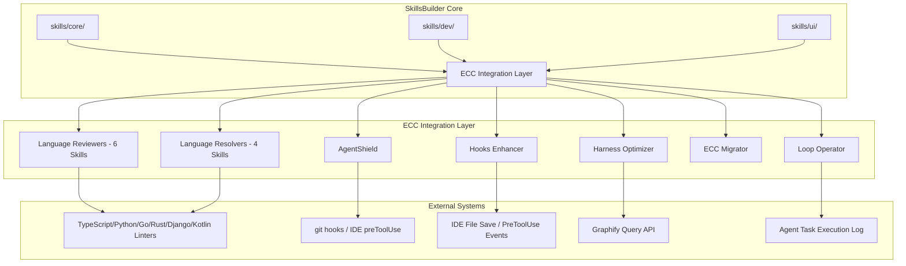
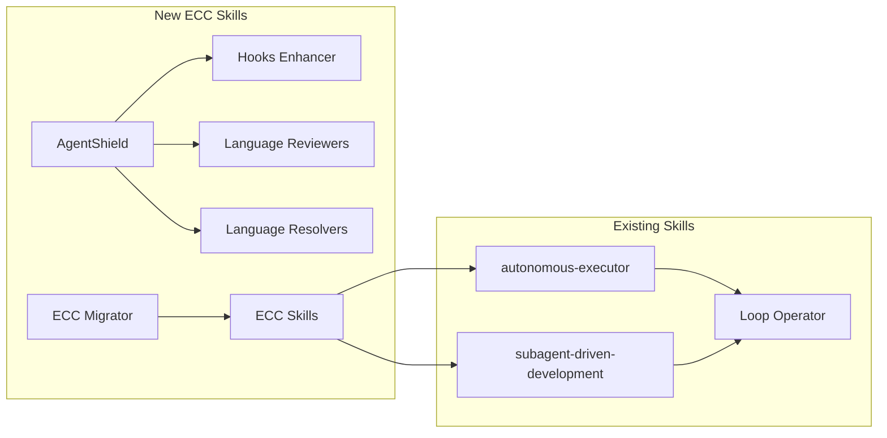

# Design Document

## Overview

本設計文件定義 **ECC Integration** 功能的技術實現方案。ECC（Everything Claude Code）是一個生產就緒的 AI Coding Agent 強化框架，擁有 63 個專業化 Subagent、251 個 Workflow Skills、79 個 Slash Commands、AgentShield 安全掃描系統、Hooks 自動化系統等核心能力。

本功能的目標是將 ECC 的核心能力整合至 SkillsBuilder 專案，使 SkillsBuilder 成為 ECC 優勢與自身既有能力的功能超集（Superset）。本次整合將新增 15 個技能至 `skills/dev/` 目錄，涵蓋語言專屬 Reviewer/Resolver、安全掃描、Hooks 增強、Harness Optimizer、Loop Operator 等範疇。

---

## Architecture

### 整體架構



### 技能目錄結構

```
skills/dev/
├── typescript-reviewer/          # Requirement 1
├── python-reviewer/              # Requirement 1
├── go-reviewer/                  # Requirement 1
├── rust-reviewer/                # Requirement 1
├── django-reviewer/              # Requirement 1
├── kotlin-reviewer/              # Requirement 1
├── typescript-build-resolver/    # Requirement 2
├── python-build-resolver/        # Requirement 2
├── go-build-resolver/            # Requirement 2
├── rust-build-resolver/          # Requirement 2
├── agent-shield/                 # Requirement 3
│   └── hook-examples/            # Hook configuration examples
├── hooks-enhancer/               # Requirement 4
│   └── hooks/                    # Hook configuration templates
├── harness-optimizer/            # Requirement 5
├── ecc-migrator/                 # Requirement 6
│   └── ecc-compatibility-matrix.md
├── loop-operator/                # Requirement 7
└── [existing skills...]
```

### 技能間關係



---

## Components and Interfaces

### Component 1: Language Reviewer Agent

**Purpose**: Language-specific code review with static analysis tool integration

**Interface**:
- **Input**: Source code file(s) with language identifier
- **Output**: Structured review report with 4 sections:
  1. `語法規範違反` (Syntax violations)
  2. `慣用寫法改進建議` (Idiomatic improvements)
  3. `最佳實踐合規性` (Best practices compliance)
  4. `摘要` (Summary with statistics)

**Key Behaviors**:
1. Detect static analysis tool availability and report `[可用]` / `[不可用]` status
2. If all tools unavailable, switch to "semantic review mode" and continue
3. Categorize issues by severity: `Critical` (runtime/safety issues), `Warning` (non-idiomatic), `Info` (style suggestions)

**Dependencies**:
- TypeScript: `tsc`, `eslint`
- Python: `pylint`, `mypy`
- Go: `gofmt`, `go vet`
- Rust: `rustc`, `clippy`
- Django: `flake8`, `django-lint`
- Kotlin: `kotlinc`, `detekt`

---

### Component 2: Language Resolver Agent

**Purpose**: Automated build error diagnosis and repair suggestions

**Interface**:
- **Input**: Build error message with context (file, line number)
- **Output**: Three-section response:
  1. `診斷` (Root cause analysis in full sentences)
  2. `修復` (Executable command or code changes)
  3. `預防` (Prevention guidance in full sentences)

**Key Behaviors**:
1. Parse error messages and identify root cause
2. If dependency version conflict detected, report as `package@version-range` format
3. If error format unrecognizable, request user to provide complete error output

---

### Component 3: AgentShield Security Scanner

**Purpose**: Automated security scanning before git push or manual code review

**Interface**:
- **Input**: Staged files (git mode) or code snippet (manual mode, ≤500 lines)
- **Output**: Structured report with scan results

**Four Scanning Modules**:
1. **Hardcoded Secrets Detection**: API keys, passwords, tokens (regex patterns)
2. **Dynamic Execution Detection**: `eval()`, `exec()` calls
3. **Dependency Vulnerability Scan**: CVE database check (package.json/requirements.txt)
4. **Injection Risk Detection**: SQL/shell injection patterns

**Security Level Definitions**:
- **Critical**: Authentication bypass, data leak, remote code execution, `eval()`/`exec()`
- **Warning**: Security best practice violations (no input validation, weak hashing)

**Behavior**:
- Critical issues: Exit non-zero, abort git push
- Warning issues: Exit zero, report "通過掃描（有 N 個警告）"
- No issues: Report "安全掃描通過" with ISO 8601 timestamp

**Timeout**: 120 seconds, report partial progress if exceeded

---

### Component 4: Hooks Enhancer

**Purpose**: Generate IDE-specific hook configurations for automated quality checks

**Four Hook Templates**:
1. **auto-formatter**: Execute Prettier/Black/gofmt after file save
2. **tsc-type-check**: Run `tsc --noEmit` after TypeScript file modification
3. **console-log-detector**: Detect `console.log`/`print` statements with line numbers
4. **import-validator**: Detect unresolved imports or missing dependencies

**Output Formats**:
- Kiro: `.kiro/hooks/*.json` schema
- Claude Code: `.claude/settings.json` hooks array
- Cursor: `hooks/hooks-cursor.json` format

**Error Handling**:
- If tool not installed, output installation command and continue other hooks

---

### Component 5: Harness Optimizer

**Purpose**: Context window management and token cost optimization

**Three-Block Report**:
1. `目前已用 token` (Number + percentage)
2. `預估剩餘可用 token` (Number)
3. `建議的上下文裁剪策略` (Specific actions like "use `graphify query` instead of reading X documents")

**Key Behaviors**:
- If context > 80% capacity, suggest `graphify query` as alternative to full file reads
- For tasks with >5 module dependency depth, suggest batching with dependency topology from `graphify query`

**Cost Tracking Mode** (opt-in via `SKILL.md`):
- Report per-execution token consumption
- On "結束 session", output comprehensive summary

---

### Component 6: ECC Skills Bridge (ecc-migrator)

**Purpose**: Convert ECC Workflow Skills to SkillsBuilder format

**Interface**:
- **Input**: ECC skill content (YAML or Markdown)
- **Output**: SkillsBuilder `SKILL.md` draft with YAML frontmatter

**Annotation System**:
- Insert `# [REVIEW NEEDED]: <reason>` comments for:
  1. ECC-specific dependencies (e.g., Claude Code built-in MCP tools)
  2. Claude Code-specific APIs (e.g., `SubAgent()` calls)
  3. Missing tools in SkillsBuilder `skills/` directory

**Slash Command Handling**:
- Append "Cross-IDE Triggering Guide" section explaining:
  - Kiro: Trigger Keywords search
  - Claude Code: `/command-name`
  - Cursor: `@skills/`

**Compatibility Matrix** (`ecc-compatibility-matrix.md`):
- Table 1: Verified migratable ECC skills (Name → SkillsBuilder name → Verified Date)
- Table 2: Known incompatible skills (Name → Reason)

---

### Component 7: Loop Operator

**Purpose**: Agent execution loop anomaly detection and intervention

**Detection Algorithm**:
- If same tool called >3 times consecutively with output similarity <5% (character difference rate), trigger warning

**Warning Output**:
- Message: "偵測到潛在迴路 — 工具名稱 X 已連續呼叫 N 次，輸出相似度 Y%"
- Three intervention options:
  1. "強制終止並摘要當前進度" (Abort and summarize progress)
  2. "調整策略後重新啟動" (Input new strategy and restart)
  3. "忽略此次警告繼續執行" (Reset counter and continue)

**Autonomous Mode**:
- Auto-enabled during `autonomous-executor` or `subagent-driven-development` skill execution

**Silence Timeout**:
- If no tool calls or output updates for 10 minutes, prompt user to continue or abort

---

### Component 8: INSTALL.ps1 Integration

**New Skills to Synchronize** (15 total):
1. typescript-reviewer
2. python-reviewer
3. go-reviewer
4. rust-reviewer
5. django-reviewer
6. kotlin-reviewer
7. typescript-build-resolver
8. python-build-resolver
9. go-build-resolver
10. rust-build-resolver
11. agent-shield
12. hooks-enhancer
13. harness-optimizer
14. ecc-migrator
15. loop-operator

**INSTALL.ps1 Changes**:
- Add "ECC 整合技能" section to output summary
- Format: `[已同步] {skill-name}` or `[略過] {skill-name}（目錄不存在）`
- Show "共同 N / 15 個 ECC 技能" at end

**verify.ps1 Changes**:
- Add "ECC 技能格式驗證" section
- Validate `SKILL.md` exists with `name` and `description` frontmatter fields
- Output: `[通過]` or `[失敗: 原因]` per skill

---

### Component 9: Documentation Updates

**New Files**:
1. `wiki/entities/ecc-integration.md` - ECC framework overview + 15 new skills list
2. `docs/ecc-integration-guide.md` - Comprehensive guide with:
   - "ECC 能力對應表" (Skill mapping table)
   - "AgentShield 啟用指南" (Hook configuration code block)
   - "hooks-enhancer 配置教學" (Formatter installation + hook configs)

**Modified Files**:
1. `README.md` - Update skill count from 42 to 57, add 15 new skills to table
2. `instructions.html` - Add 15 new skills to search results with 4 fields:
   - Skill name (code format)
   - Category (`dev`)
   - Trigger method (text description)
   - Use case description (one line)

---

## Data Models

### SKILL.md Frontmatter Schema

All new skills MUST use the following YAML frontmatter structure:

```yaml
---
name: skill-name              # Required: Matches directory name, kebab-case
description: Single-line description  # Required: <80 characters
---
# Skill Title (Markdown H1)

[Main content...]
```

**Required Fields**:
- `name`: Matches directory name (kebab-case)
- `description`: Single-line description
- `Trigger Keywords`: At least 3 keywords (comma-separated Chinese/English)
- `Prerequisites`: List of required tools

**Example** (typescript-reviewer/SKILL.md):
```yaml
---
name: typescript-reviewer
description: Language-specific TypeScript code review with tsc/eslint integration
---

# TypeScript Reviewer

[... rest of content ...]
```

---

### Review Report Data Structure

All Language Reviewers output the following structured format:

```markdown
## [Tool Status]
- tsc: [可用] / [不可用]
- eslint: [可用] / [可用]

## 語法規範違反
[...] (Critical severity issues)

## 慣用寫法改進建議
[...] (Warning severity issues)

## 最佳實踐合規性
[...] (Info severity issues)

## 摘要
- Critical: X
- Warning: Y
- Info: Z
```

---

### AgentShield Report Data Structure

**Critical/Warning Report**:
```markdown
## [問題類型]
(a) 硬編碼秘鑰 / (b) 動態執行 / (c) 套件漏洞 / (d) 注入風險

## [檔案路徑與行號]
path/to/file.ts:42

## [修復建議]
[Specific actionable guidance]
```

**Warning Summary**:
```
通過掃描（有 N 個警告）
```

**No Issues**:
```
安全掃描通過 2024-01-15T14:30:00Z
```

**Timeout**:
```
掃描逾時，已完成 N 項掃描，第 M 項未完成
```

---

### Loop Operator Detection Data Structure

**Warning Output**:
```markdown
⚠️ 偵測到潛在迴路 — 工具名稱 X 已連續呼叫 N 次，輸出相似度 Y%

選項:
1. 強制終止並摘要當前進度
2. 調整策略後重新啟動
3. 忽略此次警告繼續執行
```

**Silence Timeout**:
```
⚠️ 靜默超時警告：已 10 分鐘無活動，是否繼續等待？（輸入 Y 繼續等待 / 輸入 N 終止任務）
```

---

## Correctness Properties

**PBT Applicability Assessment**:

After analyzing all acceptance criteria, the following categories were identified:

- **PROPERTY** (suitable for property-based testing): `ecc-migrator` format conversion, `loop-operator` loop detection algorithm
- **EXAMPLE** (suitable for example-based unit tests): AgentShield scan results, hooks-enhancer hook generation, INSTALL.ps1 synchronization, documentation validation
- **EDGE_CASE** (covered by property generators): Error handling, malformed input, tool unavailability
- **INTEGRATION** (not suitable for PBT): IDE hook deployment, git push events, file system operations
- **SMOKE** (not suitable for PBT): Infrastructure setup, tool availability checks

**Decision Rationale**:
1. **ecc-migrator**: Contains pure parsing/formatting logic with clear input/output behavior. Round-trip properties applicable.
2. **loop-operator**: Contains algorithmic logic (consecutive calls, similarity calculation). Properties about consecutive patterns applicable.
3. **AgentShield**: Contains rule-based scanning logic, but external service interaction (git hooks, CVE database) makes it unsuitable for pure PBT.
4. **hooks-enhancer**: Generates IDE-specific configurations. Testable via example-based tests.
5. **INSTALL.ps1**: PowerShell script with specific file operations. Testable via example-based tests.
6. **Language Reviewers/Resolvers**: Primarily configuration and static analysis tool invocation. Not suitable for PBT.

---

### Property 1: ECC Skills Format Round-Trip Conversion

*For any* valid ECC skill content (YAML or Markdown format), if the ecc-migrator parses it and outputs a SkillsBuilder SKILL.md format, then re-parsing that SKILL.md output should produce an equivalent internal representation.

**Validates: Requirements 6.2, 6.3**

**Property-Based Test Strategy**:
- Generate random ECC skill YAML/Markdown with varying structures
- Test round-trip: ECC → ecc-migrator → SKILL.md → ecc-migrator → same internal representation
- Edge cases: Empty fields, missing optional fields, special characters in descriptions

---

### Property 2: Loop Detection Algorithm Correctness

*For any* sequence of tool call outputs, if the same tool is called more than 3 times consecutively and the output similarity falls below 5%, the loop-operator MUST output a warning with the correct tool name, call count, and similarity percentage.

**Validates: Requirements 7.2**

**Property-Based Test Strategy**:
- Generate random tool call output sequences with varying similarity percentages
- Test edge cases: Exactly 3 calls (no warning), exactly 5% similarity (boundary), exactly 1% similarity (warning)
- Verify warning message format matches specification

---

### Property 3: Loop Operator Silence Timeout

*For any* agent execution that remains silent (no tool calls or output updates) for more than 10 minutes, the loop-operator MUST output the silence timeout warning.

**Validates: Requirements 7.5**

**Property-Based Test Strategy**:
- Simulate different silence durations (9:59, 10:00, 10:01 minutes)
- Verify warning output at 10-minute threshold
- Test reset behavior after user responds

---

## Property Reflection

After reviewing all identified properties:

1. **Property 1 (Round-Trip Conversion)**: Uniquely tests the ecc-migrator's parsing and formatting logic. No redundancy with other properties.
2. **Property 2 (Loop Detection)**: Uniquely tests the consecutive call detection algorithm. No redundancy with other properties.
3. **Property 3 (Silence Timeout)**: Uniquely tests the time-based timeout logic. No redundancy with other properties.

**Conclusion**: All three properties provide unique validation value. No redundancy detected.

---

## Error Handling

### Language Reviewers / Resolvers

1. **Static Analysis Tool Unavailable**: Report `[不可用]`, switch to semantic review mode
2. **Malformed Error Message**: Output "無法識別的錯誤格式" and request complete error output
3. **File Not Found**: Output error with file path and suggested fix

### AgentShield

1. **Git Not Available**: Switch to manual mode with code snippet input (≤500 lines)
2. **Scanning Timeout (120s)**: Report "掃描逾時，已完成 N 項掃描，第 M 項未完成"
3. **CVE Database Unavailable**: Log warning, continue scanning other modules

### Hooks Enhancer

1. **Formatter Not Installed**: Output installation command and continue other hooks
2. **IDE Schema Unrecognized**: Output error with supported IDE list

### Harness Optimizer

1. **Graphify Unavailable**: Report limitation and suggest manual context management
2. **Token Estimation Error**: Log warning, output approximate values

### ecc-migrator

1. **Invalid ECC Format**: Output error with expected format examples
2. **Missing References**: Annotate with `[REVIEW NEEDED]: Missing tool reference`

### loop-operator

1. **Similarity Calculation Error**: Log warning, output conservative warning message
2. **Agent Execution State Lost**: Reset counters, await new execution

---

## Testing Strategy

### Unit Tests (Example-Based)

1. **AgentShield Scan Results**
   - Test hardcoded secret detection (API key, password, token patterns)
   - Test `eval()`/`exec()` detection
   - Test dependency vulnerability scan (package.json/requirements.txt parsing)
   - Test SQL/shell injection pattern detection
   - Test timeout behavior (120 seconds)
   - Test manual mode (code snippet input, ≤500 lines)

2. **Hooks Enhancer Output**
   - Test Kiro hook JSON schema compliance
   - Test Claude Code hooks array format
   - Test Cursor hooks format
   - Test tool-unavailable handling (output installation command)
   - Test INSTALL.ps1 summary output

3. **INSTALL.ps1 / verify.ps1**
   - Test skill synchronization for 15 new ECC skills
   - Test missing directory handling (output `[略過]`)
   - Test verify.ps1 SKILL.md format validation
   - Test ECC skills format validation output

4. **Documentation Updates**
   - Test README.md skill count update (42 → 57)
   - Test instructions.html search result display
   - Test ecc-integration.md file creation
   - Test ecc-integration-guide.md sections

### Property-Based Tests

1. **ecc-migrator Format Round-Trip**
   - Generate random ECC skill YAML/Markdown
   - Verify internal representation equivalence after round-trip
   - Edge cases: Empty fields, missing optional fields, special characters

2. **loop-operator Loop Detection**
   - Generate random tool call output sequences
   - Verify warning output at >3 calls with <5% similarity
   - Edge cases: Exactly 3 calls, exactly 5% similarity, exactly 1% similarity

3. **loop-operator Silence Timeout**
   - Simulate different silence durations
   - Verify warning at 10-minute threshold
   - Test reset behavior after user response

### Integration Tests

1. **Git Hook Integration**
   - Test AgentShield triggers on git push
   - Test hooks-enhancer triggers on file save
   - Test loop-operator integration with autonomous-executor

2. **Tool Availability Detection**
   - Test static analysis tool detection (tsc, eslint, pylint, mypy, etc.)
   - Test fallback to semantic review mode when all tools unavailable

3. **INSTALL.ps1 Full Flow**
   - Test synchronization to global skills directory
   - Test symlink creation (fallback to copy on admin failure)

### Test Configuration

- **Property-Based Tests**: Minimum 100 iterations per property
- **Tag Format**: `Feature: ecc-integration, Property {number}: {property_text}`
- **Example-Based Tests**: 5-10 representative examples per component
- **Integration Tests**: 1-3 examples per external service interaction

### Testing Tools Recommendation

- **TypeScript/JavaScript**: Jest (unit), fast-check (property-based)
- **PowerShell**: Pester (unit/integration)
- **Python**: pytest (unit/integration), hypothesis (property-based)
