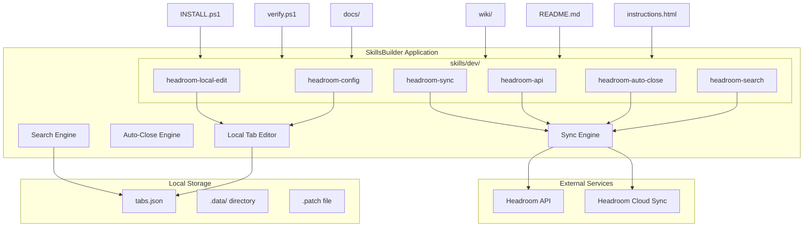

# Design Document: Headroom Integration

## Overview

This design document specifies the architecture and implementation plan for integrating Headroom (browser tab management tool) into SkillsBuilder. Headroom is an automated browser tab management tool that identifies and closes inactive tabs to save system resources (memory, CPU, battery) and maintain a clean workspace. SkillsBuilder will integrate Headroom's API and tab management capabilities by creating 6 headroom-related skills in the `skills/dev/` directory, along with comprehensive documentation.

### Integration Goals
1. Integrate Headroom's tab management capabilities into SkillsBuilder
2. Create 6 headroom-related skills in `skills/dev/` directory:
   - `headroom-sync` - Sync Headroom tabs to local cache
   - `headroom-api` - Direct Headroom API calls for tab operations
   - `headroom-auto-close` - Automatic tab closing based on rules
   - `headroom-search` - Search and filter Headroom tabs
   - `headroom-local-edit` - Local tab management (offline mode)
   - `headroom-config` - Configuration management
3. Support Headroom API and local tab synchronization
4. Automatically sync Headroom tabs when user opens browser
5. Enable tab management and manipulation within SkillsBuilder

## Architecture

### System Context



### Component Interactions

1. **Sync Engine**: Coordinates with Headroom API to fetch tab data, handles rate limiting and retries
2. **Auto-Close Engine**: Implements rules-based tab closing logic with locking mechanism
3. **Search Engine**: Provides filtering capabilities on local tab cache
4. **Local Tab Editor**: Enables offline tab management with patch generation
5. **Configuration Manager**: Manages user preferences and skill configurations

## Components and Interfaces

### 1. headroom-sync Skill

**Location**: `skills/dev/headroom-sync/`

**Purpose**: Synchronize Headroom tabs to local cache for offline access and multi-device sync

**Key Files**:
- `SKILL.md` - Skill documentation with YAML frontmatter
- `sync-engine.ts` - Sync logic implementation
- `.data/tabs.json` - Cached tab data
- `.data/sync-status.json` - Sync status and metadata

**Interfaces**:

```typescript
interface SyncConfig {
  cloudSync?: boolean;
  maxRetries?: number;
  retryInterval?: number;
  timeout?: number;
  useCacheIfOffline?: boolean;
  cacheTTL?: number;
}

interface Tab {
  id: string;
  title: string;
  url: string;
  groupId?: string;
  groupName?: string;
  lastAccessed: string; // ISO 8601
  isPinned: boolean;
  isInactive: boolean;
  tags?: string[];
}

interface SyncResult {
  tabs: Tab[];
  totalTabs: number;
  activeTabs: number;
  inactiveTabs: number;
  lastSync: string; // ISO 8601
  cloudSynced?: boolean;
}
```

**API Flow**:
1. Check if Headroom API is accessible
2. If `cloudSync: true`, call `/sync/pull` first
3. Fetch all tabs from `/tabs` endpoint
4. Validate and normalize tab data
5. Save to `.data/tabs.json`
6. Generate sync summary report

### 2. headroom-api Skill

**Location**: `skills/dev/headroom-api/`

**Purpose**: Direct Headroom API calls for tab operations (close, group, tag)

**Key Files**:
- `SKILL.md` - Skill documentation with YAML frontmatter
- `api-reference.md` - Complete API endpoint documentation
- `api-client.ts` - API client implementation
- `validators.ts` - Parameter validation logic

**API Endpoints**:

| Endpoint | Method | Description |
|----------|--------|-------------|
| `/tabs` | GET | Fetch all tabs |
| `/tabs/close` | POST | Close specified tabs |
| `/groups` | GET | Fetch all groups |
| `/sync/pull` | POST | Pull latest tabs from cloud |

**Interfaces**:

```typescript
interface ApiActionParams {
  action: 'close' | 'group' | 'tag';
  tab_ids?: string[];
  group?: string;
  target_group?: string;
  tags?: string[];
  remove_tags?: string[];
}

interface CloseResult {
  closedCount: number;
  failedTabIds: string[];
}

interface GroupResult {
  movedCount: number;
  targetGroup: string;
}

interface TagResult {
  updatedCount: number;
  operation: 'add' | 'remove';
}
```

**Validation Rules**:
- `close` requires either `tab_ids` OR `group`
- `group` requires `tab_ids` AND `target_group`
- `tag` requires `tab_ids` AND either `tags` OR `remove_tags`

### 3. headroom-auto-close Skill

**Location**: `skills/dev/headroom-auto-close/`

**Purpose**: Automatically close inactive tabs based on configurable rules

**Key Files**:
- `SKILL.md` - Skill documentation with YAML frontmatter
- `auto-close-rules.md` - Default rule configuration
- `auto-close-engine.ts` - Auto-close logic implementation
- `.lock` - Exclusive lock file for concurrent execution

**Default Rules Configuration**:

```json
{
  "rules": {
    "inactiveThresholdMinutes": 15,
    "minUsageFrequency": 1,
    "usageFrequencyWindowMinutes": 60,
    "groupPriority": {
      "high": ["work", "project", "important"],
      "medium": ["development", "coding"],
      "low": ["research", "reading"]
    },
    "savePrivateTabs": true,
    "excludedGroups": ["pinned", "essential"],
    "maxTabsToClose": 100
  }
}
```

**Interfaces**:

```typescript
interface AutoCloseRule {
  inactiveThresholdMinutes: number;
  minUsageFrequency: number;
  usageFrequencyWindowMinutes: number;
  groupPriority: Record<string, string[]>;
  savePrivateTabs: boolean;
  excludedGroups: string[];
  maxTabsToClose: number;
}

interface AutoCloseResult {
  filteredCount: number;
  closedCount: number;
  skippedReasons: string[];
  tabsClosed: string[];
}
```

**Workflow**:
1. Acquire exclusive lock (`.lock` file)
2. Call `headroom-sync` to update tab state
3. Filter tabs based on rules
4. Call Headroom API to close filtered tabs
5. Release lock
6. Generate summary report

### 4. headroom-search Skill

**Location**: `skills/dev/headroom-search/`

**Purpose**: Search and filter Headroom tabs by various criteria

**Key Files**:
- `SKILL.md` - Skill documentation with YAML frontmatter
- `search-engine.ts` - Search and filtering logic

**Interfaces**:

```typescript
interface SearchParams {
  keyword?: string;
  group?: string;
  state?: 'active' | 'inactive';
  limit?: number;
  offset?: number;
}

interface SearchResult {
  total: number;
  results: Tab[];
  activeCount: number;
  inactiveCount: number;
  groups: string[];
}
```

**Search Capabilities**:
- Keyword search (title, URL)
- Group filtering
- State filtering (active/inactive)
- Combined AND search
- Pagination support

### 5. headroom-local-edit Skill

**Location**: `skills/dev/headroom-local-edit/`

**Purpose**: Manage local tab cache without Headroom API connection

**Key Files**:
- `SKILL.md` - Skill documentation with YAML frontmatter
- `.config.json` - Local edit configuration
- `local-editor.ts` - Local tab editing logic
- `tabs.json.patch` - Patch file for changes

**Configuration**:

```json
{
  "autoSyncOnClose": true,
  "patchEnabled": true,
  "patchHistoryLimit": 10
}
```

**Interfaces**:

```typescript
interface PatchEntry {
  timestamp: string; // ISO 8601
  action: 'update' | 'delete' | 'create';
  tabId: string;
  changes: Record<string, unknown>;
}

interface EditResult {
  tabId: string;
  changes: Record<string, unknown>;
  patchGenerated: boolean;
}
```

### 6. headroom-config Skill

**Location**: `skills/dev/headroom-config/`

**Purpose**: Manage Headroom integration configuration

**Key Files**:
- `SKILL.md` - Skill documentation with YAML frontmatter
- `config-manager.ts` - Configuration management

**Configuration Structure**:

```typescript
interface HeadroomConfig {
  apiKey?: string;
  apiUrl?: string;
  cloudSync: boolean;
  syncInterval?: number;
  autoCloseEnabled: boolean;
  autoCloseRules: AutoCloseRule;
  localEditConfig: {
    autoSyncOnClose: boolean;
  };
}
```

## Data Models

### Tab Data Model

```typescript
interface Tab {
  id: string;
  title: string;
  url: string;
  groupId?: string;
  groupName?: string;
  lastAccessed: string; // ISO 8601
  isPinned: boolean;
  isInactive: boolean;
  tags?: string[];
  usageFrequency: number;
  lastUsageWindowMinutes: number;
}
```

### Sync Status Model

```typescript
interface SyncStatus {
  lastSync: string; // ISO 8601
  nextSync?: string; // ISO 8601
  syncSuccess: boolean;
  error?: string;
  tabsSynced: number;
  cloudSynced: boolean;
}
```

### Patch File Model

```typescript
interface PatchFile {
  version: string;
  createdAt: string; // ISO 8601
  entries: PatchEntry[];
}
```

## Correctness Properties

*A property is a characteristic or behavior that should hold true across all valid executions of a system—essentially, a formal statement about what the system should do. Properties serve as the bridge between human-readable specifications and machine-verifiable correctness guarantees.*

### Property 1: Sync preserves all tabs

*For any* valid tab data returned from Headroom API, the sync operation SHALL preserve all tabs in the local cache without loss or duplication.

**Validates: Requirements 1.1**

### Property 2: Sync summary accuracy

*For any* successful sync operation, the summary report SHALL contain accurate counts for total tabs, active tabs, inactive tabs, and last sync timestamp.

**Validates: Requirements 1.2**

### Property 3: Rate limiting retry preserves request order

*For any* sequence of rate-limited API responses, the sync engine SHALL maintain the original request queue and retry in the same order after each 30-second delay.

**Validates: Requirements 1.3**

### Property 4: Error handling includes actionable information

*For any* API failure (timeout or 5xx status), the error output SHALL include the error type and a list of actionable remediation steps.

**Validates: Requirements 1.4**

### Property 5: Cloud sync ensures consistency

*For any* sync configuration with `cloudSync: true`, the sync operation SHALL ensure local and cloud tab states are identical before proceeding.

**Validates: Requirements 1.5**

### Property 6: INSTALL.ps1 reports headroom-sync status

*For any* execution of INSTALL.ps1, the output summary SHALL include headroom-sync status indicator `[可用]` or `[不可用]`.

**Validates: Requirements 1.6**

### Property 7: API close operation is idempotent

*For any* close operation, executing it multiple times on the same tab IDs SHALL produce the same result as executing it once.

**Validates: Requirements 2.2**

### Property 8: API parameter validation rejects invalid input

*For any* API call with missing or invalid parameters, the system SHALL reject the request before making the API call.

**Validates: Requirements 2.5**

### Property 9: Auto-close rules filter correctly

*For any* tab and auto-close rule configuration, the filtering logic SHALL correctly identify tabs that match all rule criteria.

**Validates: Requirements 3.2, 3.4**

### Property 10: Exclusive lock prevents concurrent execution

*For any* concurrent auto-close attempts, only one execution SHALL proceed while others wait for the lock to be released.

**Validates: Requirements 3.5**

### Property 11: Fallback rules apply when config missing

*For any* execution where `auto-close-rules.md` is missing or invalid, the system SHALL use default rules and indicate this in the output.

**Validates: Requirements 3.6**

### Property 12: Search AND logic combines filters

*For any* search query with multiple filter parameters, the results SHALL only include tabs matching ALL specified criteria.

**Validates: Requirements 4.5**

### Property 13: Search cache refreshes when stale

*For any* search operation where local cache is older than 30 minutes, the system SHALL automatically refresh the cache before searching.

**Validates: Requirements 4.6**

### Property 14: Local edit generates patch record

*For any* local edit operation, the system SHALL generate a patch file entry with timestamp, action type, and change details.

**Validates: Requirements 5.5**

### Property 15: Auto-sync triggers after local edit

*For any* local edit configuration with `autoSyncOnClose: true`, the system SHALL automatically trigger headroom-sync after completing the edit.

**Validates: Requirements 5.6**

### Property 16: INSTALL.ps1 syncs all headroom skills

*For any* execution of INSTALL.ps1, all 6 headroom-related skills SHALL be synchronized to the global skill pool if present in `skills/dev/`.

**Validates: Requirements 6.1, 6.2**

### Property 17: INSTALL.ps1 handles missing skills gracefully

*For any* execution of INSTALL.ps1 in an environment lacking some headroom skills, the system SHALL mark missing skills as `[略過]` and continue with existing skills.

**Validates: Requirements 6.3**

### Property 18: verify.ps1 validates headroom skill format

*For any* execution of verify.ps1, all headroom skills in `skills/dev/` SHALL be validated for proper `SKILL.md` format with required YAML frontmatter fields.

**Validates: Requirements 6.4**

### Property 19: INSTALL.ps1 creates headroom cache directory

*For any* installation of headroom-sync skill, the system SHALL create the `.data/` directory if it does not exist.

**Validates: Requirements 6.5**

### Property 20: API key validation enforces format

*For any* execution where `HEADROOM_API_KEY` environment variable is set, the system SHALL validate the key format (8-64 alphanumeric characters) and report the result.

**Validates: Requirements 6.6**

### Property 21: Search includes all headroom skills

*For any* search query matching headroom skill names or keywords, the search results SHALL include all relevant headroom-related skills.

**Validates: Requirements 7.3**

### Property 22: API key prompt links to documentation

*For any* headroom-api execution without valid API key, the system SHALL display a提示 with link to documentation.

**Validates: Requirements 7.5**

## Error Handling

### Sync Engine Errors

| Error Type | HTTP Code | Handling |
|------------|-----------|----------|
| Rate Limited | 429 | Retry every 30s, max 5 times |
| Server Error | 5xx | Log error, retry with exponential backoff |
| Timeout | N/A | Return error after 30s, suggest remediation |
| Authentication | 401/403 | Log error, check API key validity |

### Auto-Close Engine Errors

| Error Type | Handling |
|------------|----------|
| Config Parse Error | Use defaults, indicate in output |
| Lock Acquisition | Wait or fail fast based on mode |
| API Failure | Log error, return partial results |

### Search Engine Errors

| Error Type | Handling |
|------------|----------|
| Cache Missing | Auto-trigger sync |
| Cache Stale | Auto-refresh if allowed |

### Local Editor Errors

| Error Type | Handling |
|------------|----------|
| Tab ID Not Found | List available IDs in error message |
| Invalid Change | Validate before applying |

## Testing Strategy

### Dual Testing Approach

1. **Unit Tests**: Verify specific examples, edge cases, and error conditions
2. **Property Tests**: Verify universal properties across all inputs

### Property-Based Testing

The following properties will be tested using property-based testing with a minimum of 100 iterations per property:

| Property | Testing Library | Test Type |
|----------|----------------|-----------|
| Property 1 | fast-check | Sync integrity |
| Property 2 | fast-check | Summary accuracy |
| Property 3 | fast-check | Retry logic |
| Property 7 | fast-check | Idempotent close |
| Property 8 | fast-check | Validation |
| Property 9 | fast-check | Rule filtering |
| Property 12 | fast-check | AND search logic |
| Property 13 | fast-check | Cache refresh |
| Property 14 | fast-check | Patch generation |

### Unit Tests

1. **headroom-sync**:
   - Test sync with various tab counts (0, 1, 100, 1000)
   - Test cloud sync integration
   - Test rate limiting scenarios

2. **headroom-api**:
   - Test close, group, tag operations
   - Test parameter validation
   - Test error responses

3. **headroom-auto-close**:
   - Test rule filtering
   - Test private tab exclusion
   - Test lock mechanism

4. **headroom-search**:
   - Test keyword search
   - Test group filtering
   - Test combined filters

5. **headroom-local-edit**:
   - Test update operations
   - Test delete operations
   - Test patch generation

### Integration Tests

1. **Full Sync Flow**: End-to-end sync with cloud sync
2. **Auto-Close Workflow**: Complete auto-close with rule filtering
3. **Multi-Device Sync**: Test sync across devices

### Configuration Tests

1. **API Key Validation**: Test various API key formats
2. **Rule Configuration**: Test rule file parsing and defaults
3. **Environment Variables**: Test all environment variable scenarios

### Test Configuration

All property-based tests will:
- Run minimum 100 iterations
- Include feature and property tags for traceability
- Use appropriate mocks for external dependencies
- Include comprehensive logging for debugging