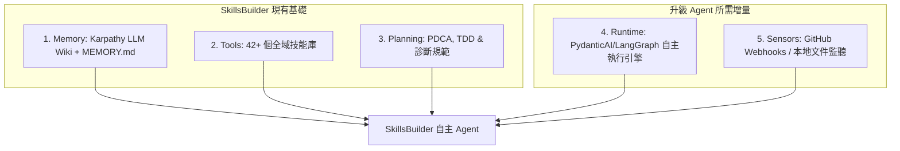

# SkillsBuilder 演進為自主 AI Agent 之戰略可行性報告

本報告深度評估 **SkillsBuilder** 專案如何從現有的「技能庫與知識庫」演進為一個能夠「獨立思考、自主執行、自我進化」的 **全功能自主 AI Agent**。

---

## 🎯 核心結論：不僅可行，而且具備極高的天然優勢

根據現代 AI Agent 的標準定義：
$$\text{Agent} = \text{大語言模型 (LLM)} + \text{規劃規劃 (Planning)} + \text{持久記憶 (Memory)} + \text{工具集 (Tools)}$$

SkillsBuilder 已經具備了其中的三大支柱，非常適合作為一個獨立 Agent 實體向外延伸：

---

## 🚀 SkillsBuilder 演進為 AI Agent 的核心架構設計

為了將本專案轉型為獨立的 AI Agent，我們需要在現有架構上進行以下「增量實作」：

### 1. 執行引擎層 (Execution Loop) — 建立 Agent 大腦循環
*   **現狀：** 目前技能的調用依賴外部 Agent（如 Antigravity IDE、Claude Code）讀取 SKILL.md 並執行命令。
*   **演進：** 使用 **PydanticAI** 或 **LangGraph** 在專案中建立一個自主的 Python/Node.js 執行循環（Agent Loop）。
*   **邏輯：**
    1.  接收到外部指令後，由 Agent 的 `Planning` 模組制定任務拆解計畫。
    2.  大腦根據 `skills/` 目錄下的 YAML 宣告，**自主載入並調用對應的技能腳本**。
    3.  執行 `verify.ps1` 自主驗證執行結果，失敗時自動進入 `bug-diagnose` 閉環修正。

### 2. 持久記憶層 (Compounding Memory) — 實作自我進化
*   **現狀：** 專案中定義了 `session-memory` 技能，但尚未將 SQLite 向量檢索與 FTS5（全文檢索）程式碼落地。
*   **演進：** 在 `wiki/` 目錄下建立一個輕量級的本地數據庫（如 SQLite）。
    *   Agent 每次完成任務後，自動將 `RCA`（根因分析）與 `CAPA`（糾正預防）轉化為向量 Embeddings 存入數據庫。
    *   在下次啟動任務時，Agent 會自動搜尋歷史經驗，實現真正的「閉環複利式成長」。

### 3. 主動感知層 (Sensors & Triggers) — 從被動響應到主動出擊
*   **現狀：** 工具必須由開發者手動點擊或下達指令觸發。
*   **演進：** 引入 **事件驅動（Event-driven）觸發器**：
    *   **GitHub/GitLab 監聽**：當專案收到新的 Issue 或 Pull Request 時，自動喚醒 SkillsBuilder Agent。
    *   **本地檔案監視器**：監聽開發者的保存動作，自動在背景執行代碼優化、生成測試、或更新知識圖譜（`graphify`）。

---

## 📅 演進路線圖 (Strategic Roadmap)

### 🚀 第一階段：工具與協議標準化 (已完成)
*   **成果：** 實作 [mcp_server.js](file:///f:/Self-developed_Apps/SkillsBuilder/tools/mcp_server.js)，將技能以標準工具接口暴露。
*   **價值：** 奠定了 Tools 基礎，任何外部 Agent 都能無痛調用 SkillsBuilder 的能力。

### ⚙️ 第二階段：自主 Agent 引擎落地 (Next Step)
*   **目標：** 在專案中引入 `agent_runner.py`（基於 PydanticAI）。
*   **實作內容：**
    *   將 SkillsBuilder 本身包裝成一個可以獨立在 terminal 運行的 CLI 工具（例如：`skillsbuilder-run "優化這個模組"`）。
    *   它能自己讀取 `wiki/global_rules.md` 作為 system prompt，自行規劃並使用內建技能完成任務。

### 🧠 第三階段：Hermes 閉環與環境監聽 (Maturity)
*   **目標：** 實現自動化與自我學習。
*   **實作內容：**
    *   結合 GitHub Actions 或本地 Daemon，讓 Agent 能夠 24 小時守護代碼倉庫。
    *   實作自動化的知識吸收機制，定期閱讀外部 RSS、技術文檔，並自動將新知識 Ingest 寫入 `wiki/concepts/`。

---

## 💡 總結
SkillsBuilder **非常適合、且天然具備** 演進為一個自主 AI Agent 的條件。

它現有的 [42+ 個技能](file:///f:/Self-developed_Apps/SkillsBuilder/README.md#1-為-ai-裝備工業級技能-skill-library) 是絕佳的「手與腳」，[Karpathy LLM Wiki](file:///f:/Self-developed_Apps/SkillsBuilder/wiki/index.md) 是它的「記憶與經驗庫」。我們只需要**為它穿上一件「自主執行引擎（如 PydanticAI/LangGraph Loop）」的衣服**，它就能立刻變身為一個能夠獨立接單、修復代碼、維護知識的強大自主 AI 代理人。
