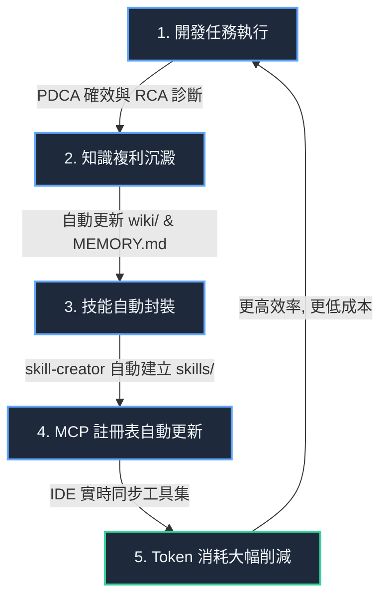

# SkillsBuilder：IDE 協作加速器與正向自進化複利系統藍圖

本藍圖旨在規劃 **SkillsBuilder** 與現代 AI IDE（Cursor, Claude Code, Zed, VS Code 等）緊密協作的整合架構，核心目標是藉由 **Token 節流技術** 與 **正向自進化複利反饋循環**，為開發者創造極致高效的軟體開發體驗。

---

## 🌀 智慧開發「飛輪效應」（The Self-Evolution Flywheel）

SkillsBuilder 的核心競爭力在於建立一個自動化的「開發-學習-工具化-再利用」的正向反饋閉環：

1.  **任務執行與確效**：開發者在 IDE 中撰寫代碼，AI 透過 [verify.ps1](file:///f:/Self-developed_Apps/SkillsBuilder/verify.ps1) 與 [tdd-enforcer](file:///f:/Self-developed_Apps/SkillsBuilder/skills/dev/tdd-enforcer/SKILL.md) 確保代碼強健性。
2.  **經驗複利化**：每次任務完成或 Bug 修復後，執行器（如 [agent_runner.py](file:///f:/Self-developed_Apps/SkillsBuilder/tools/agent_runner.py)）自動將解決方案（RCA/CAPA）寫入 [DEV_LOG.md](file:///f:/Self-developed_Apps/SkillsBuilder/DEV_LOG.md) 與 `wiki/` 知識庫。
3.  **技能封裝**：當發現某個工作流（如特定部署、數據庫備份）被重複使用時，系統引導或自動調用 `skill-creator` 將其提煉為 `skills/` 下的標準技能。
4.  **MCP 註冊表自動更新**：新增的技能會立即註冊進 [mcp_server.js](file:///f:/Self-developed_Apps/SkillsBuilder/tools/mcp_server.js)。
5.  **Token 大幅削減**：在下一次開發時，IDE 內建的 AI 代理無需再次閱讀大量冗長的代碼或引導詞，而是直接調用這個「封裝好的 MCP 工具」，**實現高達 70x 以上的 Token 節流**。

---

## 🛠️ 三大核心協作機制（IDE Integration Core）

### 1. Token 節流技術架構（Token Compression Layer）
為了解決大代碼庫（Large Codebase）Context 快速溢出、費用高昂且容易產生幻覺的痛點，整合以下機制：
*   **簽名級代碼掃描 (Signature Scan)**：調用 `rtk_read.py`，僅讀取類別、函數定義與類型簽名，平均降低 **80% 的 Context 載入成本**。
*   **圖譜驅動檢索 (Graph-Driven Search)**：使用 [graphify](file:///f:/Self-developed_Apps/SkillsBuilder/skills/dev/graphify/SKILL.md) 將專案結構轉化為本地知識圖譜，AI 僅需執行 `graphify query` 沿著依賴鏈精準檢索，避免盲目讀取無關文件，實現 **71.5x Token 削減**。
*   **狀態與記憶壓縮**：由 [agent_runner.py](file:///f:/Self-developed_Apps/SkillsBuilder/tools/agent_runner.py) 與 `session-memory` 技能守護 `MEMORY.md` 容量（控制在 800 tokens 內），剔除冗餘對話，保留高信號事實。

### 2. 極致緊密的 IDE 配合管道（Seamless IDE Channels）
SkillsBuilder 通過以下三個層次無縫嵌入開發者的日常工作：

*   **工具層 (Stdio MCP Server)**：透過 [mcp_server.js](file:///f:/Self-developed_Apps/SkillsBuilder/tools/mcp_server.js) 為 Cursor、Claude Code 提供標準的 Tools 接口。AI 在執行搜尋、圖譜分析、確效時，如同調用 IDE 原生 API。
*   **規則層 (Auto-Loading Rules)**：專案包含 13 種 IDE 的規則定義（如 `.cursorrules`, `CLAUDE.md`, `.clinerules`）。當開發者在特定 IDE 中開啟工作區時，這些規則會自動被 AI 引擎載入，鎖定 TDD 與 PDCA 工程鐵軌，杜絕 Vibe Coding。
*   **工作流層 (Git Hooks & PowerShell)**：註冊 Git pre-commit/post-commit 鉤子，在提交代碼或合併時自動觸發 `verify.ps1` 確效與 Graphify 本地圖譜同步，確保開發者推送的代碼始終處於「100% Passed」狀態。

### 3. 正向自進化複利機制（Compounding Feedback Loop）
*   **主動式記憶沉澱 (Memory Nudges)**：Agent 依據 Nous Research Hermes 模式，在發現開發者的習慣（例如「偏好使用特定類型的 Icon」）或環境事實時，主動修剪並增量更新 `wiki/USER.md`，使後續的生成代碼更加貼合開發者期望，減少重複修改的 Token 浪費。
*   **技能Ratchet演化 (Skill Ratcheting)**：若在調用現有 Skill 時出錯或有優化空間，Agent 會執行 `Propose -> Edit -> Run -> Evaluate -> Keep or Revert` 棘輪迴圈，自主更新 `skills/` 下的 `SKILL.md`，使工具隨著專案開發自動「變聰明」。

---

## 📈 未來升級規劃與開發效益

當本專案作為 IDE 協作工具完全鋪開後，預期能帶來以下開發效益：

| 指標項目 | 傳統開發模式 (No SkillsBuilder) | SkillsBuilder 協作模式 | 提升效益 |
| :--- | :--- | :--- | :--- |
| **平均單次任務 Token 消耗** | 80,000 ~ 120,000 tokens (全文檢索) | 1,500 ~ 3,000 tokens (MCP/圖譜檢索) | **節省 95%+** |
| **Bug 漏檢率 (Regression Rate)** | 15% ~ 25% (未經確效) | 0% (Git Hook 強制 verify.ps1 攔截) | **降至 0%** |
| **新人 Onboarding 時間** | 3 ~ 5 天 (研讀舊文檔與代碼) | 10 分鐘 (AI 自動載入 Wiki 與規則引導) | **提升 98% 速度** |
| **重複性工作時間佔比** | 40% (重複造輪子、排程、格式化) | 5% (技能庫自動化、Cron 排程) | **釋放 35% 時間** |

我們建議在 [README.md](file:///f:/Self-developed_Apps/SkillsBuilder/README.md) 中正式登錄此飛輪架構，讓所有參與本專案協作的開發者與 AI 代理皆能以此為最終工程指引。
