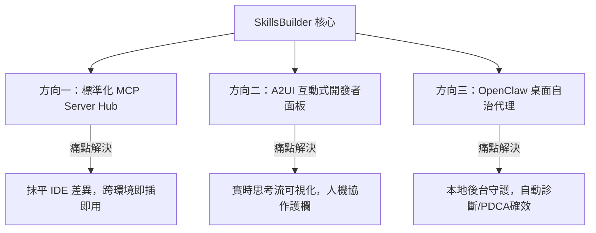

# SkillsBuilder 後續發展與工具應用走向深度評估

基於 **SkillsBuilder** 專案的定位（ClawHub 技能庫、 Andrj Karpathy LLM Wiki、Nous Research Hermes 閉環學習）、2026 年 AI Agent 的技術演進趨勢，以及專案內建的規範（[GEMINI.md](file:///f:/Self-developed_Apps/SkillsBuilder/GEMINI.md) / [AGENTS.md](file:///f:/Self-developed_Apps/SkillsBuilder/AGENTS.md)），本專案後續的發展非常適合走向以下三種極具實用價值的工具應用形態。

---

## 🗺️ 三大核心工具應用走向

---

### 方向一：標準化 MCP (Model Context Protocol) Server Hub (首選推薦)

#### 1. 概念定位
將 SkillsBuilder 擁有的 42+ 個工業級技能（如 `gitnexus`、`last30days`、`tavily`、`summarize` 等）進行標準化包裝，統一暴露為一個或多個 **MCP Servers**。

#### 2. 為什麼適合本專案？
*   **符合規範**：專案規則中明確強調 **「MCP First：優先採用 MCP 作為外部工具與資料的連接協議，避免點對點的客製化串接。」**。
*   **解決發行痛點**：目前的技能載入需要依賴 `INSTALL.ps1` 進行本地 Symbolic Link 或目錄複製。若走向 MCP Server 模式，任何支持 MCP 協議的 IDE 客户端（例如 Claude Code、Cursor、Zed、VS Code 等）只需配置一個連線網址（或本地運行指令），即可**零安裝、零配置**直接加載 SkillsBuilder 的所有技能。
*   **集中化管理**：所有的工具邏輯、API 密鑰管理均在 MCP Server 端封裝，客戶端無需了解工具的具體實現細節，大幅降低了安全風險。

#### 3. 工具應用實作路徑
1.  使用 Python（基於 `mcp` 官方 SDK）或 TypeScript 建立一個統一的 MCP Gateway。
2.  將 `skills/` 目錄下的 YAML 定義與 Shell/Python 腳本，動態註冊為 MCP 的 `Tools` 與 `Prompts`。
3.  提供一鍵啟動命令（例如 `npx skills-builder mcp-start` 或 `python mcp_server.py`），並在 Wiki 中記錄配置指南。

---

### 方向二：A2UI 互動式開發者控制面板 (A2UI Developer Dashboard)

#### 1. 概念定位
將現有的靜態門面 [index.html](file:///f:/Self-developed_Apps/SkillsBuilder/index.html) 與 [instructions.html](file:///f:/Self-developed_Apps/SkillsBuilder/instructions.html) 升級為動態的、具備實時通訊能力的 **A2UI (Agent-to-UI) 雙向控制台**。

#### 2. 為什麼適合本專案？
*   **符合設計美學與狀態同步規範**：[GEMINI.md](file:///f:/Self-developed_Apps/SkillsBuilder/GEMINI.md) 規定 **「所有 Agent 的內部思考與狀態變更，必須透過 AG-UI 協議實時串流，並透過 A2UI 保持持久化同步。」**，且設計系統要求採用 **Color Master Palette** 與 **Glassmorphism 視覺風格**。
*   **加強人機協作護欄（Human-in-the-Loop）**：對於具有破壞性（如執行寫入、刪除、推送）的技能，控制面板可以提供直觀的「攔截確認」介面，讓開發者在瀏覽器中點擊 `Approve` 釋放執行，解決「畫面上看得到，點下去卻 403」或盲目執行的風險。
*   **可視化專案大腦**：實時渲染 `wiki/` 的關聯圖譜、展示 `MEMORY.md` 與 `USER.md` 的當前狀態，並允許在 UI 上對記憶進行手動微調與修剪。

#### 3. 工具應用實作路徑
1.  採用 **Vite + Vanilla JS/Tailwind** 或輕量級框架，重構現有的 HTML 頁面。
2.  建立本地 Web API 伺服器，負責與 IDE runtime 或 Agent CLI 進行 WebSocket 雙向通訊。
3.  設計實時渲染的 Mermaid 圖譜面板，展示 Agent 的「思考路徑」與「PDCA 確效軌跡」。

---

### 方向三：OpenClaw 本地自治開發守護行程 (Autonomous Repo Daemon)

#### 1. 概念定位
將 SkillsBuilder 與 `OpenClaw` 深度綁定，作為一個本地後台守護行程（Daemon），對指定的開發倉庫進行**自主代碼檢驗與診斷優化**。

#### 2. 為什麼適合本專案？
*   **利用既有集成**：專案中已經有將 Agency Agents 安裝至 `OpenClaw` 的轉換與部署腳本（如 `convert.sh` 和 `install.ps1`）。
*   **實踐自動確效 (Verification-before-completion)**：作為後台守護行程，它能在開發者每次編輯保存文件或執行 Git Commit 時，自動觸發 `verify.ps1`，並結合 `bug-diagnose` 技能自主定位語法錯誤、API 不相容等脆弱點，在本地生成 RCA (根因分析) 並提示預防措施。
*   **閉環學習實體化**：Hermes 模式的 `cron-automations`（排程自動化）可以在深夜自主執行專案的深度重構、代碼圖譜更新（`graphify` 同步）與知識庫維護。

#### 3. 工具應用實作路徑
1.  配置 OpenClaw Gateway 監聽 SkillsBuilder 的本地工作區。
2.  利用 `skills/dev/cron-automations` 與本地 Hooks（如 Git Hooks）連結，實現事件驅動的自主確效。
3.  當確效失敗時，自動在 [DEV_LOG.md](file:///f:/Self-developed_Apps/SkillsBuilder/DEV_LOG.md) 寫入失敗紀錄並回滾。

---

## 🎯 總結與演進建議

為了讓 SkillsBuilder 專案發揮最大的商業與工程價值，最建議的**演進次序**為：

$$\text{方向一：MCP Server Hub (最速標準化，打通工具層)} \rightarrow \text{方向二：A2UI 控制台 (打通人機交互與狀態可視化)} \rightarrow \text{方向三：OpenClaw 自治守護 (打通本地執行與閉環演進)}$$

第一步建議優先實施 **方向一（MCP Server Hub）**。因為這能讓本專案內建的 42+ 個技能庫立刻釋放到其他 AI 代理工具中，奠定 **ClawHub 全明星技能庫** 作為「元平台」的江湖地位。
