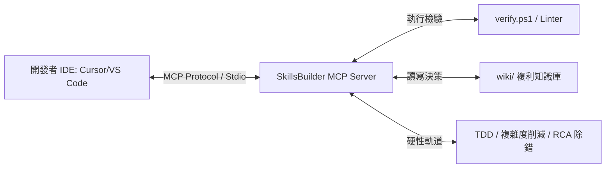

# SkillsBuilder 作為 IDE 程式設計能力優化輔助工具之可行性與定位分析

本報告探討 **SkillsBuilder** 專案如何轉型並作為「協助開發者優化 Coding 能力與工程紀律」的 IDE 輔助工具。

---

## 💡 核心結論：完全可以，且具備獨特的「行為矯正」優勢

傳統的 IDE 輔助工具（如 GitHub Copilot）主要專注於**「代碼補全」**與**「生成代碼」**，這往往會讓開發者變得懶惰、產生依賴，甚至寫出未經測試的垃圾代碼（Vibe Coding）。

而 **SkillsBuilder** 是一個 **「Agentic & Engineering Rails (智慧代理與工程護欄)」** 系統，它不只幫開發者寫代碼，更是通過**行為約束與方法論引導**，強迫並培養開發者養成「一流水準的工程思維與代碼習慣」。

---

## 🛠️ SkillsBuilder 如何具體優化開發者的 Coding 能力？

### 1. 行為矯正：強制阻斷「猜測性開發（Vibe Coding）」
專案內建的 [tdd-enforcer](file:///f:/Self-developed_Apps/SkillsBuilder/skills/dev/tdd-enforcer/SKILL.md) 與 [bug-diagnose](file:///f:/Self-developed_Apps/SkillsBuilder/skills/dev/bug-diagnose/SKILL.md) 技能，定義了嚴格的開發防禦鐵律：
*   **不寫無測試代碼**：強迫開發者在寫業務邏輯前，先理清輸入輸出（寫測試案列），實現垂直切片（Vertical Slice）。
*   **拒絕憑直覺 Debug**：當發生錯誤時，引導/強迫開發者按照 **四階段診斷流程（RCA/CAPA）** 執行：
    $$\text{根因調查 (Investigation)} \rightarrow \text{正常模式對比 (Pattern)} \rightarrow \text{科學假設 (Hypothesis)} \rightarrow \text{精準修復與預防 (Fix \& Verify)}$$
    長期下來，這能大幅提升開發者在面對複雜 Bug 時的排查直覺。

### 2. 宏觀視野：培養「爆炸半徑（Blast Radius）」與架構意識
開發者在修改代碼時，常因為看不清全局而引入 Bug（Regression）。
*   SkillsBuilder 整合了 [gitnexus](file:///f:/Self-developed_Apps/SkillsBuilder/skills/dev/gitnexus/SKILL.md) 與 [graphify](file:///f:/Self-developed_Apps/SkillsBuilder/skills/dev/graphify/SKILL.md) 技能。
*   在修改代碼前，工具會強迫（或輔助）開發者進行**影響範圍分析（Impact Analysis）**，讓開發者養成「動手前先看呼叫鏈與拓撲關係」的習慣，從而提升架構設計能力。

### 3. 複雜度克制：養成極簡主義與 YAGNI 習慣
新手開發者常犯「過度設計」或「寫出冗餘代碼」的毛病。
*   透過 [complexity-reduction](file:///f:/Self-developed_Apps/SkillsBuilder/skills/dev/complexity-reduction/SKILL.md) 技能，IDE 輔助工具會主動檢索代碼中不符合 DRY 與 YAGNI（You Aren't Gonna Need It）的區域，對複雜代碼進行「精簡拷問」，藉此訓練開發者寫出低耦合、高内聚的代碼。

### 4. 知識複利：將開發經驗轉化為持久資產
*   基於 Karpathy 的 LLM Wiki 模式（專案中的 `wiki/` 目錄），開發者與 AI 共同做出的架構決策（RCD）、踩坑記錄會被沉澱為結構化的 Markdown 文件（如專案中的 [lm_studio_prompt.md](file:///f:/Self-developed_Apps/SkillsBuilder/wiki/concepts/lm_studio_prompt.md)）。
*   這訓練了開發者「寫代碼同時寫文檔」的習慣，避免知識流失，實現個人能力的複利成長。

---

## 🚀 作為 IDE 輔助工具的落地形態

隨著我們在本階段實作了 **MCP Server Hub**，SkillsBuilder 可以無縫嵌入到主流的 IDE 生態中，成為開發者的「影子教練（Shadow Coach）」：

### 1. 形態一：Cursor 規則引導器 (Rules Driver)
將 SkillsBuilder 的規則檔（如 `.cursorrules`）和技能註冊進 Cursor。當開發者在 Cursor 中使用 AI 寫代碼時，AI 代理會主動對開發者進行「拷問」：「*你是否寫了對應的測試？*」、「*這個修改的爆炸半徑你分析過了嗎？*」。**開發者在觀察 AI 被約束的過程中，能潛移默化地學到最頂尖的軟體工程規範。**

### 2. 形態二：自動化本地確效哨兵 (Git Hook Daemon)
將 [verify.ps1](file:///f:/Self-developed_Apps/SkillsBuilder/verify.ps1) 與 Git 鉤子結合。當開發者準備提交代碼時，哨兵會自動執行 Lint 和鏈接檢查，若未通過則拒絕 commit，迫使開發者在本地就將代碼整理乾淨。

### 3. 形態三：智慧 MCP 助手
開發者可以在 IDE 終端直接調用：
*   `npx skills-builder mcp` 啟動助手。
*   命令助手：「*幫我分析這個 Function 修改後的爆炸半徑*」或「*幫我用四階段診斷這個 Bug 的原因*」。

---

## 📈 總結
**SkillsBuilder 完全有能力、且非常適合作為協助優化 Coding 能力的 IDE 輔助工具。** 

它不同於一般的自動程式碼生成工具，它是一個**「方法論約束器」**。它透過將 TDD、PDCA 確效、複雜度削減等高級工程原則工具化（Skills）與協議化（MCP），讓開發者在日常開發中被迫（並習慣）以**資深架構師的思維**去思考與編寫代碼。
