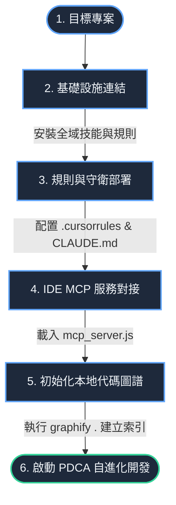

# SkillsBuilder 專案導入與初始化整合指南

本指南詳細說明如何在**新專案啟動之初**或**現有專案開發期間**，將 SkillsBuilder 的智慧引擎、工程護欄與 MCP 工具鏈整合導入至目標專案，以接管並優化後續的軟體開發流程。

---

## 🛠️ 整合流程圖（Integration Roadmap）



---

## 📌 場景一：新專案啟動之初的導入 (Greenfield Setup)

若您正準備開啟一個全新的專案，請按以下步驟初始化：

### Step 1. 一鍵環境綁定 (全域技能同步)
在新電腦上或新工作區，雙擊執行 SkillsBuilder 專案根目錄下的 [INSTALL.ps1](file:///f:/Self-developed_Apps/SkillsBuilder/INSTALL.ps1)。
*   **作用：** 將 42+ 個工業級技能同步至系統全域技能池，並為各大 IDE 部署全局引導規則。

### Step 2. 初始化目標專案結構
在您的全新專案根目錄下，命令 AI 助理或執行腳本建立以下結構：
1.  建立 `DEV_LOG.md`：鎖定 RCA & CAPA 的防禦性日誌模板。
2.  建立 `wiki/` 目錄：
    *   `wiki/index.md`：大腦導航地圖。
    *   `wiki/SCHEMA.md`：規範治理機制。

### Step 3. 部署 IDE 規則護欄
將 SkillsBuilder 的規則模版複製到新專案根目錄：
*   **Cursor 用戶**：部署 `.cursorrules`。
*   **Claude Code 用戶**：部署 `CLAUDE.md`。
*   **作用：** 新專案一開啟，AI 助理便會被強制鎖定在 TDD（測試驅動開發）與 PDCA 確效軌道上。

### Step 4. IDE MCP 服務對接
參考 [mcp_config.template.json](file:///f:/Self-developed_Apps/SkillsBuilder/mcp_config.template.json)，在您的 IDE（如 Cursor / Claude Code）中新增對接 SkillsBuilder MCP Server 的配置。

---

## 📌 場景二：現有專案開發期間的導入 (Brownfield Integration)

若您的專案已經開發到一半，希望在中途導入 SkillsBuilder 以優化後續開發並降低 Token 消耗：

### Step 1. 連接 MCP 服務與規則部署
*   將 [mcp_server.js](file:///f:/Self-developed_Apps/SkillsBuilder/tools/mcp_server.js) 的 Stdio 工具配置接入您當前的 IDE。
*   將 `.cursorrules` / `CLAUDE.md` 複製至當前專案根目錄下，立刻阻止後續的 Vibe Coding。

### Step 2. 初始化代碼圖譜 (建立低 Token 檢索基底)
在目標專案目錄下執行：
```bash
graphify .
```
*   **作用：** 掃描您已編寫的代碼結構，並於 `graphify-out/` 生成圖譜索引。
*   **後續效益：** 之後 AI 在修改既有模組時，不需要將大文件反覆讀入 context，而是直接使用 `graphify_query` 檢索依賴，**節省高達 70x 以上的 Token**。

### Step 3. 建立並同步開發日誌
*   新建 `DEV_LOG.md`。
*   在首次提交前，命令 AI 執行一次 `verify_workspace`（或 `./verify.ps1`），確保現有專案無編譯錯誤與脆弱點，並將當前狀態作為「基準點（Base Line）」記錄於開發日誌中。

---

## 🔄 導入後的後續開發循環 (Subsequent Development Loop)

一旦專案完成整合導入，後續的開發將完全遵循 **PDCA 複利反饋循環**：

```text
[開發需求/Issue] 
       │
       ▼
1. 規劃階段 (Plan) ────> 調用 graphify_query 分析爆炸半徑 (Surgical Boundary)
       │
       ▼
2. 執行階段 (Do)   ────> 精準外科手術式修改，撰寫 Unit Tests (TDD Enforcer)
       │
       ▼
3. 確效階段 (Check) ───> 調用 verify_workspace (執行 verify.ps1)，確保 100% Passed
       │
       ▼
4. 複利階段 (Act)   ───> 自動更新 DEV_LOG.md & wiki/，提煉新技能，更新 MCP 工具集
```

這套流程能確保後續寫出的每一行代碼皆是健壯且可控的，同時專案大腦（Wiki）將隨著開發的進行自動積累智慧，實現開發效能的複利增長。
