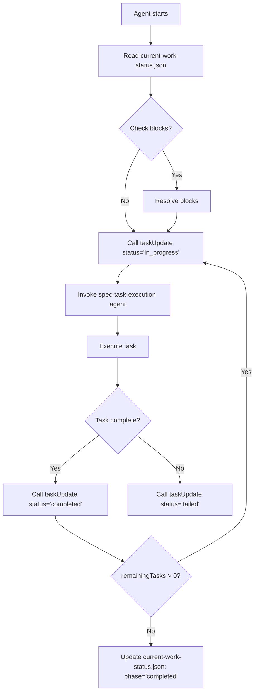
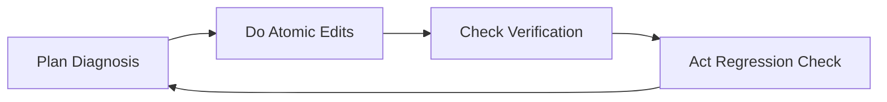

# SkillsBuilder 專案接手與續寫指南

> **最後更新**：2026-01-15  
> **專案狀態**：ECC Integration Feature (spec: ecc-integration)  
> **開發模式**：PDCA (Plan-Do-Check-Act) + Anti-Vibe Coding  
> **規範來源**：`wiki/global_rules.md`, `.kiro/steering/steering.md`

---

## 🎯 目標

本指南旨在讓其他帳號或工具能無縫接手 SkillsBuilder 專案的開發，包括：

1. **讀取 `current-work-status.json`** 了解當前進度與任務狀態
2. **開啟 `.kiro/specs/ecc-integration/tasks.md`** 確認任務詳細狀態
3. **自動恢復中斷的工作** (For AI Tools / Kiro Agents)
4. **手動接手開發** (For Human Developers)

---

## 📁 專案結構速覽

```
SkillsBuilder/
├── .kiro/
│   ├── specs/
│   │   ├── ecc-integration/           # Current Spec
│   │   │   ├── .config.kiro          # Spec metadata (workflow, type)
│   │   │   ├── requirements.md       # Acceptance criteria
│   │   │   ├── design.md             # Technical design
│   │   │   └── tasks.md              # Implementation tasks
│   │   └── headroom-integration/
│   ├── hooks/                         # IDE hooks configuration
│   └── steering/                      # Steering files (e.g., steering.md)
├── skills/
│   ├── core/                          # Core productivity skills
│   └── dev/                           # Development skills (15 ECC skills to be added)
├── docs/                              # Development standards & documentation
├── wiki/                              # Knowledge base & entities
├── INSTALL.ps1                        # Sync skills to global pool
├── verify.ps1                         # Validation & testing
├── bootstrap.ps1                      # One-command integration
├── DEV_LOG.md                         # Development log with PDCA
├── current-work-status.json           # **Current work status (JSON)**
└── instructions.html                  # Interactive skill guide
```

---

## 📋 第一部分：手動接手手冊 (For Human Developers)

### 1. 專案概況

#### 專案名稱
**SkillsBuilder** - AI Agent Skill元平台

#### 主要目錄結構
- `skills/{category}/{skill-name}/` - Skill 存放目錄
- `.kiro/specs/` - Spec 文件目錄 (requirements, design, tasks)
- `wiki/` - 知識庫與實體索引
- `docs/` - 開發標準與文檔
- `hooks/` - IDE hook 配置

#### 核心腳本
| 腳本 | 用途 |
|------|------|
| `INSTALL.ps1` | 同步本地 skills 至全域技能池 (`~/.gemini/antigravity/skills`) |
| `verify.ps1` | 執行 LINT 與同步完整性檢查 |
| `bootstrap.ps1` | 一鍵無縫整合 (部署 13 個 IDE 規則、建立 DEV_LOG 模板、初始化 wiki) |

### 2. 定期狀態更新格式

每隔 2 小時更新 `current-work-status.json`，包含：

```json
{
  "timestamp": "2026-01-15T10:30:00Z",
  "current-phase": "spec-execution",
  "current-spec": "ecc-integration",
  "last-completed-task": "10.4 Create `docs/ecc-integration-guide.md`",
  "next-tasks": ["9.1 Update INSTALL.ps1", "10.1 Create wiki/entities/ecc-integration.md"],
  "remaining-tasks": 39,
  "total-progress": "26%",
  "blocks": ["none"],
  "next-action-required": "none"
}
```

### 3. 手動接手步驟

1. **讀取 `current-work-status.json`** 了解進度
2. **開啟 `.kiro/specs/ecc-integration/tasks.md`** 確認任務狀態
3. **從 `last-completed-task` 之後的任務繼續執行**
4. **如有 `blocks`，先處理阻塞問題**
5. **執行 `verify.ps1` 確認無錯誤**

---

## 🤖 第二部分：自動接手手冊 (For AI Tools)

### 1. 狀態文件標準 (`current-work-status.json`)

**Purpose**: Allow AI agents to programmatically determine current project state and resume work.

**JSON Schema**:

```json
{
  "specId": "b229097b-4948-44a4-a3bd-97bf704af91b",
  "workflowType": "requirements-first",
  "specType": "feature",
  "lastUpdated": "2026-01-15T10:30:00Z",
  "totalTasks": 53,
  "completedTasks": 26,
  "remainingTasks": 27,
  "currentPhase": "task-execution",
  "currentTaskId": "10.4 Create `docs/ecc-integration-guide.md`",
  "lastCompletedTaskId": "10.3 Update `instructions.html` search index",
  "nextTaskIds": ["9.1 Update INSTALL.ps1 for 15 new ECC skills", "10.1 Create `wiki/entities/ecc-integration.md`"],
  "readyTasks": ["9.1", "10.1"],
  "blocks": [],
  "nextActionRequired": "none"
}
```

**Field Descriptions**:

| Field | Type | Description |
|-------|------|-------------|
| `specId` | string | Unique spec identifier (UUID) |
| `workflowType` | string | `"requirements-first"` or `"design-first"` |
| `specType` | string | `"feature"`, `"bugfix"`, `"hotfix"` |
| `lastUpdated` | string | ISO 8601 timestamp |
| `totalTasks` | number | Total number of tasks in tasks.md |
| `completedTasks` | number | Number of completed tasks |
| `remainingTasks` | number | Number of pending tasks |
| `currentPhase` | string | `"task-execution"`, `"verification"`, `"completed"` |
| `currentTaskId` | string | Current task being worked on |
| `lastCompletedTaskId` | string | Last completed task |
| `nextTaskIds` | string[] | Array of next tasks to execute |
| `readyTasks` | string[] | Array of task IDs that are ready to start |
| `blocks` | string[] | List of blocking issues (empty if none) |
| `nextActionRequired` | string | `"none"`, `"user-input"`, `"investigation"` |

### 2. 自動接手流程 (For Kiro/Agents)



**Step-by-Step Execution**:

1. **Read Status**
   ```javascript
   const status = JSON.parse(fs.readFileSync('current-work-status.json', 'utf8'));
   ```

2. **Check Blocks**
   - If `blocks.length > 0`, investigate and resolve before proceeding
   - Update status and notify user if blocks cannot be resolved

3. **Update Task Status**
   ```javascript
   taskUpdate(status = 'in_progress', taskId = status.nextTaskIds[0]);
   ```

4. **Invoke Sub-Agent**
   ```javascript
   invoke_sub_agent(
     name = 'spec-task-execution',
     prompt = `Resume work on spec: ${status.specId}. 
               Current task: ${status.nextTaskIds[0]}. 
               Last completed: ${status.lastCompletedTaskId}.
               Review requirements.md and design.md if needed.`
   );
   ```

5. **Report Completion**
   ```javascript
   taskUpdate(status = 'completed', taskId = status.nextTaskIds[0]);
   ```

6. **Repeat** until `remainingTasks === 0`

### 3. 狀態更新觸發時機

| Trigger | Action |
|---------|--------|
| Every 2 hours | Auto-update `current-work-status.json` |
| Task completion | Immediate update |
| Block discovery | Immediate update |
| Task变更 (add/remove/reorder) | Immediate update |

---

## 📖 第三部分：開發文檔 (DEV_LOG.md)

### 1. 啟用開發模式

輸入以下指令之���啟用 PDCA 流程與設計系統：

- **「啟動 SkillsBuilder 開發模式」**
- **「啟動 SkillsBuilder 開發模式進行...」**

### 2. 開發模式 SOP



#### [Plan] (Diagnosis) - 扫描代碼脆弱點
- Identify component fragility (state, async flow, dependency chains)
- Identify UI dissonance (color, spacing, typography)
- Do NOT guess the root cause

#### [Do] (Atomic Edits) - 外科手術式修改
- Make minimal, surgical edits
- Record failures, RCA, CAPA in DEV_LOG.md

#### [Check] (Verification) - 執行 verify.ps1
- Baseline: zero compiler warnings, zero Console errors
- Run: `powershell -ExecutionPolicy Bypass -File verify.ps1`

#### [Act] (Defensive Regression Check) - 檢查依賴與 UI
- Scan dependencies (no naming clashes, no conflicts)
- Align UI button visibility with backend permissions
- Request permission before git push

### 3. 每日開發記錄格式

```markdown
## 2026-01-15

### 10:00-12:00
- **任務內容 (PDCA)**:
  - **Plan (規劃)**：...
  - **Do (執行)**：...
  - **Check (驗證)**：...
  - **Act (持續改進)**：...
- **代碼變更**：變更檔案與說明
- **測試結果**：執行 verify.ps1 - 通過/失敗
- **依賴關係**：影響的模組
```

### 4. 錯誤記錄格式

```markdown
### 錯誤 2026-01-15-001

**時間**：10:30  
**錯誤訊息**：[錯誤描述]  
**根因分析 (RCA)**：[原因]  
**矯正措施 (CAPA)**：[修正方式]  
**影響範圍**：[受影響的模組]
```

---

## ✅ 第四部分：手動與自動接手檢查清單

### 手動接手

- [ ] 讀取 `current-work-status.json`
- [ ] 確認 spec 路徑 `.kiro/specs/{spec-name}/`
- [ ] 開啟 `tasks.md` 確認任務狀態
- [ ] 從 `readyTasks` 或 `nextTaskIds` 繼續
- [ ] 執行 `verify.ps1` 確認無錯誤

### 自動接手

- [ ] 讀取 `current-work-status.json`
- [ ] 檢查 `blocks` 是否解除
- [ ] 執行 `taskUpdate(status='in_progress')`
- [ ] 呼叫 `spec-task-execution` sub-agent
- [ ] 上報 `taskUpdate(status='completed')`
- [ ] 重複直到 `remainingTasks = 0`

---

## 📝 規範與標準

### 1. Spec 文件格式

所有 spec 文件應保持在 `.kiro/specs/` 目錄下，每個 spec 應包含：

| File | Purpose |
|------|---------|
| `.config.kiro` | Spec metadata (specId, workflowType, specType) |
| `requirements.md` | Acceptance criteria (User Stories + ACs) |
| `design.md` | Technical design (architecture, components) |
| `tasks.md` | Implementation tasks (task ID, description, AC mapping) |

### 2. 任務狀態規範

| Status | Description |
|--------|-------------|
| `pending` | Task not yet started |
| `queued` | Task queued for execution |
| `in_progress` | Task currently being worked on |
| `completed` | Task successfully completed |
| `blocked` | Task cannot proceed due to external dependency |

### 3. 狀態更新規範

- 發現 block 時應立即更新 `current-work-status.json`
- 任務變更時應立即更新 `tasks.md`
- 所有開發活動應記錄在 `DEV_LOG.md`

### 4. 完成驗收標準

1. 所有 `tasks.md` 中的任務標記為 `[x]`
2. 執行 `verify.ps1` 通過 100%
3. `DEV_LOG.md` 記錄完整 RCA/CAPA (如適用)
4. `current-work-status.json` 更新為 `phase='completed'`

---

## 🚨 注意事項

1. **所有 spec 文件應保持在 `.kiro/specs/` 目錄下**
2. **每個 spec 應包含 `requirements.md`, `design.md`, `tasks.md`**
3. **status 應使用：`pending`, `queued`, `in_progress`, `completed`**
4. **發現 block 時應立即更新 `current-work-status.json`**
5. **所有開發活動應記錄在 `DEV_LOG.md`**
6. **完成後執行 `verify.ps1` 確認無錯誤**
7. **無法繼續時應更新 `blocks` 與 `nextActionRequired`**

---

## 📚 相關參考文件

| File | Description |
|------|-------------|
| `wiki/global_rules.md` | Global development rules for all IDEs |
| `.kiro/steering/steering.md` | Workspace-level steering directives |
| `AGENTS.md` | Agent persona and development standards |
| `CLAUDE.md` | Claude Code rules (Source of Truth) |
| `bootstrap.ps1` | One-command integration script |
| `INSTALL.ps1` | Skill synchronization script |
| `verify.ps1` | Validation and testing script |

---

## 🔄 後續步驟 (For Current Spec: ecc-integration)

Based on `tasks.md`, the remaining tasks are:

1. **Task 9**: Update `INSTALL.ps1` and `verify.ps1` for 15 ECC skills
2. **Task 10**: Update documentation (wiki, README, instructions.html, ecc-integration-guide.md)
3. **Task 11-13**: Final validation checkpoints

**Ready Tasks** (from tasks.md):
- `9.1`, `9.2`, `10.1`, `10.2`, `10.3`, `10.4`

**Total Remaining**: 27 tasks

---

**Last Updated**: 2026-01-15  
**Next Action**: Resume from `9.1 Update INSTALL.ps1 for 15 new ECC skills`
