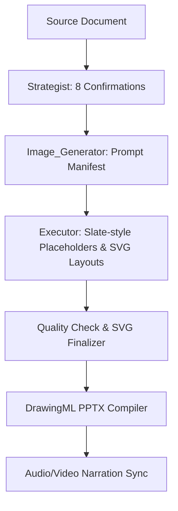

# Entity: PPT Master (DrawingML Presentation System)

## Description
PPT Master is an AI-driven, professional-grade presentation generation system. Unlike traditional tools that export static images inside a slide deck, PPT Master parses source materials (PDF, Word, Excel, URLs, Markdown) and compiles them into **100% native, element-level editable DrawingML vectors** inside Microsoft PowerPoint.

## Associated Tools & Commands
*   **project_manager.py**: Init, validate, and manage slide deck projects.
*   **notebooklm_to_md.py**: Specialized parser for Study Guides and FAQs into Consulting Box grids.
*   **notebooklm_podcast_sync.py**: Aligns dialogue/narratives and sets auto-advance timers.
*   **notebooklm_pipeline.py**: Unified orchestration script for end-to-end execution.
*   **svg_editor**: Heat-reloaded local server (`localhost:5050`) for interactive layout review.
*   **svg_to_pptx.py**: DrawingML vector slide compiler.

## Magic Phrases / Triggering Keywords
- 「幫我 **製作簡報** / **生成 PPT** / **轉化為簡報**」
- 「導入文檔來源...」
- 「使用 **Consulting Box 諮詢卡片風** 排版」
- 「整合 **NotebookLM 學習指南/對談音軌**」

## Pipeline Workflow (Multi-Role Collaboration)

## Integration Guardrails
- **Sequential Indexing Shield**: All generated SVG slides and headers must be prefixed with 2-digit sequential indexing (e.g. `# 01 Cover`, `# 02 Glossary`) to prevent slide order mismatch during compilation.
- **Color Master Palette Compliance**: All generated layouts must match the exact HSL gray master rules (`#0F172A` Slate 900 base, `#1E293B` Slate 800 surface, `#60A5FA` accent).
- **Proportional Timing Interpolation**: Auto-advance transitions in `animations.json` must be proportionally calculated based on word count anchors when native slicing tools are unavailable.

## References
- `wiki/concepts/consulting-box-style.md`: Aesthetic layout rules.
- `skills/ppt-master/SKILL.md`: Main execution blueprint.
