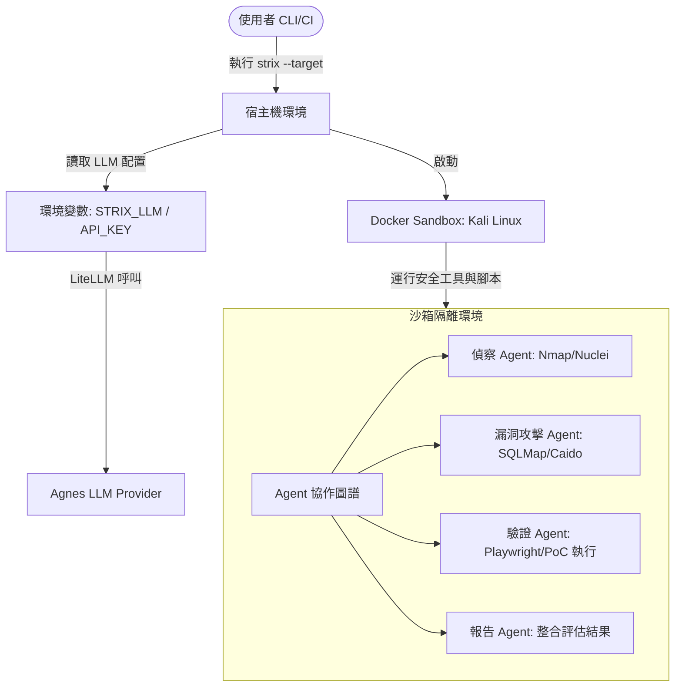

# Entity: Strix AI Penetration Testing Framework

**Strix AI** 是一個開源的自主 AI 滲透測試與漏洞驗證框架。不同於傳統基於簽章特徵（signature-based）或靜態代碼分析（SAST）的掃描器，Strix 通過模擬人類安全研究員的「思考-計劃-行動-觀察」認知迴圈進行主動安全測試。

---

## 核心技術架構

Strix 的架構圍繞著**多代理協作（Multi-Agent Orchestration）**與**安全沙箱（Docker Sandboxing）**展開：



### 1. 代理人圖譜模型 (Graph of Agents)
Strix 並非由單一 LLM 運行，而是利用多個具有專門系統提示詞（System Prompts）的 AI 代理人。
- **Reconnaissance Agent（偵察）**：執行目標對應的網域掃描、連接埠探測與 API endpoint 探索。
- **Exploitation Agent（漏洞利用）**：分析偵察報告，尋找 SQL 注入、跨站腳本 (XSS)、不安全的直接物件參照 (IDOR) 或配置錯誤。
- **Validation Agent（PoC 驗證）**：在沙箱內動態編寫並執行 Python/Playwright 程式碼，實際向目標發送攻擊載荷，確認漏洞屬實，而非僅靠靜態分析猜測。
- **Reporting Agent（報告）**：彙整所有成功漏洞利用的 PoC，編寫修補程式建議。

### 2. Docker 沙箱隔離
為了防止 AI 代理人寫出的 Exploit 腳本失控或損害宿主機系統，所有的安全工具（如 Nmap、Sqlmap、Caido、Playwright 等）都在一個**隔離的 Kali Linux Docker 容器**中運作。這保證了安全測試的「零污染」與「可重複性」。

---

## Agnes AI 對接規格

在本專案環境中，Strix AI 透過 **Agnes AI** 平台進行推理驅動：

- **API 端點 (Base URL)**: `https://apihub.agnes-ai.com/v1`
- **模型 ID**: `agnes-2.0-flash`
- **授權憑證**: `Bearer token` 搭配 `AGNES_API_KEY`（透過 `OPENAI_API_KEY` 環境變數傳遞）
- **成本與限制**: 由於使用 Agnes 模型是**完全免費**的，因此在運行 Strix 時不需要額外指定 `--max-budget-usd` 參數來防範 Token 爆炸花費。

---

## 常用命令與工作流指南

### 本地測試工作流

當對本機開發的 Web 專案或 API 進行測試時：

1. **啟動 Docker 服務**。
2. **在 PowerShell 中注入環境變數**：
   ```powershell
   $env:OPENAI_API_BASE="https://apihub.agnes-ai.com/v1"
   $env:OPENAI_API_KEY="sk-SMfdNFc2SalcdSeqvOqajT1xldoMSdNSOAZ1ra1KyeyYfAuu"
   $env:STRIX_LLM="openai/agnes-2.0-flash"
   ```
3. **對本地目錄執行深度掃描**：
   ```powershell
   strix --target ./ --mount ./
   ```
4. **檢查 `./strix_runs/` 下生成的漏洞報告與 PoC 腳本**。

---

## YAGNI 適用性評估 (YAGNI Gate)

### 何時使用 Strix AI
- 💡 **重大版本發布前**：確認專案沒有低級的安全配置疏漏或暴露的 Secret。
- 💡 **新增敏感資料流**：例如新增使用者認證流程、購物車金流、或敏感檔案上傳時。
- 💡 **對接外部 Webhook 或 LLM**：防範 OWASP LLM Top 10（如 Prompt Injection 或 Excessive Agency 導致的安全邊界破壞）。

### 何時不需使用
- 🚫 **單純的 UI/UX 微調**：例如修改 CSS 莫蘭迪色系或網頁留白（Spacing）時，不需要進行安全滲透測試。
- 🚫 **內部單元測試**：Strix 用於端到端的安全確效，一般開發中代碼語法糾錯優先使用 `verify.ps1` 進行 linting 和 TS 編譯檢查即可。
